```mermaid
graph TB
    %% Atlas MCP System Architecture & Flow Diagram
    
    subgraph "🚀 STARTUP SEQUENCE"
        START[./start_atlas.sh] 
        START --> CLEAN[Clean old processes]
        CLEAN --> TO[1. Task Orchestrator :4006]
        TO --> PROXY[2. MCP Proxy :9090]
        PROXY --> CORE[3. Atlas Core :8000]
        CORE --> VIEWER[4. 3D Viewer :8080]
    end
    
    subgraph "🎯 USER REQUEST FLOW"
        USER[👤 User Request] 
        USER --> INTERFACE[Atlas Core Interface Agent]
        INTERFACE --> SECURITY[LLM3 Security Check]
        SECURITY --> |approved| ORCHESTRATOR[Intelligent Task Orchestrator]
        SECURITY --> |rejected| REJECT[❌ Security Rejection]
        
        ORCHESTRATOR --> TOOLS[Tool Selection & Execution]
        TOOLS --> RESPONSE[Response Generation]
        RESPONSE --> TTS[TTS Voice Output]
    end
    
    subgraph "📡 MCP PROXY ARCHITECTURE"
        MCPPROXY["🌐 MCP Proxy Server<br/>:9090<br/>(Go-based)"]
        
        MCPPROXY --> TTS_UA["🎤 Ukrainian TTS<br/>mcp_tts_server.py"]
        MCPPROXY --> TASK_ORCH["📋 Task Orchestrator<br/>:4006/sse"]
        MCPPROXY --> AUTOMATION["🤖 Automation MCP<br/>AppleScript/System"]
        MCPPROXY --> PLAYWRIGHT["🌐 Playwright Better<br/>Browser Automation"]
        MCPPROXY --> GITHUB["📂 GitHub Integration<br/>Repository Management"]
        MCPPROXY --> APPLESCRIPT["🍎 AppleScript MCP<br/>macOS Integration"]
    end
    
    subgraph "🧠 ATLAS CORE AGENTS"
        CORE_SYS["🎯 Atlas Core :8000<br/>(FastAPI)"]
        
        CORE_SYS --> AGENT1["LLM1 - Interface Agent<br/>User Communication"]
        CORE_SYS --> AGENT2["LLM2 - Orchestrator Agent<br/>Task Planning"]
        CORE_SYS --> AGENT3["LLM3 - Security Agent<br/>Command Validation"]
        CORE_SYS --> MONITOR["Monitor Agent<br/>System Health"]
    end
    
    subgraph "🗃️ TASK ORCHESTRATOR DETAILS"
        TASK_HTTP["📋 Task Orchestrator<br/>:4006<br/>(FastAPI HTTP)"]
        
        TASK_HTTP --> NEO4J["📊 Neo4j Database<br/>(Graph Storage)"]
        TASK_HTTP --> SESSIONS["🔄 Session Management"]
        TASK_HTTP --> PLANNING["📝 Task Planning"]
        TASK_HTTP --> EXECUTION["⚡ Task Execution"]
    end
    
    subgraph "🔧 TOOL EXECUTION FLOW"
        TOOL_REQ["Tool Request"] 
        TOOL_REQ --> REGISTRY["Tool Registry Lookup"]
        REGISTRY --> |found| PROXY_CALL["MCP Proxy Call"]
        REGISTRY --> |not found| FALLBACK["Local Fallback"]
        
        PROXY_CALL --> SERVICE_EXEC["Service Execution"]
        SERVICE_EXEC --> RESULT["Tool Result"]
        
        FALLBACK --> LOCAL_EXEC["Local Command"]
        LOCAL_EXEC --> RESULT
    end
    
    %% PROBLEM AREAS (highlighted in red)
    classDef errorClass fill:#ff6b6b,stroke:#d63031,color:#fff
    classDef warningClass fill:#fdcb6e,stroke:#e17055,color:#000
    classDef successClass fill:#00b894,stroke:#00a085,color:#fff
    
    %% Проблемні зони
    TASK_HTTP:::warningClass
    NEO4J:::errorClass
    PROXY_CALL:::errorClass
    SERVICE_EXEC:::warningClass
    
    %% Annotations для проблем
    TASK_HTTP -.->|"⚠️ subtask_X not found"| ERROR1["JSON metadata issues<br/>Task creation problems"]
    NEO4J -.->|"❌ Driver missing"| ERROR2["Neo4j installation issues<br/>Graph DB unavailable"]
    PROXY_CALL -.->|"❌ 404 errors"| ERROR3["MCP Proxy routing issues<br/>Service discovery problems"]
    
```

# 🔍 Atlas MCP System Flow Analysis

## 📊 STARTUP SEQUENCE
1. **start_atlas.sh** → Clean processes
2. **Task Orchestrator** (:4006) → HTTP server for task management  
3. **MCP Proxy** (:9090) → Go-based service aggregator
4. **Atlas Core** (:8000) → Main FastAPI system with 3 LLM agents
5. **3D Viewer** (:8080) → Optional web interface

## 🎯 REQUEST PROCESSING FLOW
```
User Request → Interface Agent (LLM1) → Security Check (LLM3) → Task Orchestrator (LLM2) → Tool Selection → MCP Proxy → Service Execution → Response + TTS
```

## 🔴 IDENTIFIED PROBLEMS

### 1. **Task Orchestrator Issues**
- ❌ `subtask_1/2/3 not found` - Task creation/lookup failures
- ⚠️ `Invalid JSON in metadata` - Data formatting issues  
- ✅ Neo4j driver now installed

### 2. **MCP Proxy Problems**
- ❌ 404 errors on `/tools`, `/health` endpoints
- ⚠️ Service discovery issues
- 🔍 Tools show as available (143) but routing fails

### 3. **Service Communication**
- ✅ Atlas Core responds (:8000)
- ✅ Task Orchestrator health (:4006) 
- ❌ MCP Proxy routing (:9090)
- ⚠️ Ukrainian TTS connection issues

## 🚨 ROOT CAUSE HYPOTHESIS
The **MCP Proxy** appears to be running but has routing/endpoint issues. Tool registry shows 143 tools available, but when Atlas Core tries to execute tools via proxy, it gets 404s.

**Next Investigation Steps:**
1. Check MCP Proxy endpoints directly
2. Verify proxy → service communication  
3. Test tool execution bypass (direct calls)
4. Examine Task Orchestrator subtask creation logic
