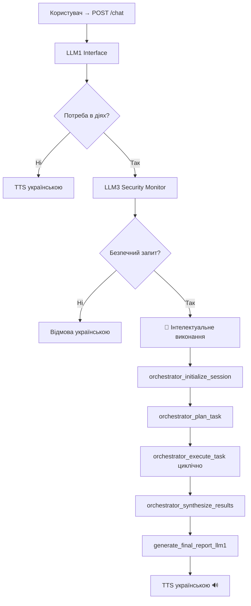
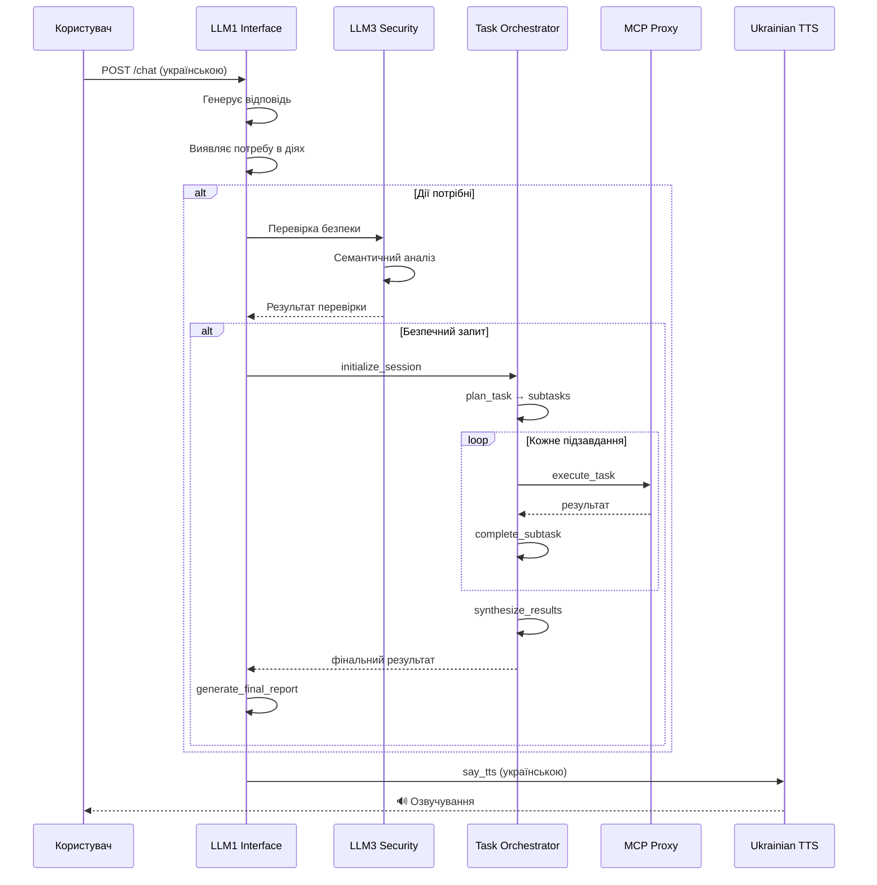

# Atlas-mcp System: Інтелектуальна Архітектура 🚀

> Canonical system logic document. Оновлено: 2025-08-26

## Changelog (excerpt)

| Дата | Зміни |
|------|-------|
| 2025-08-26 | Уніфікація документації, нормалізація кількості інструментів (107), доповнення секції 9.1, вирівнювання термінів (service/tool), додано цей Changelog |
| 2025-08-25 | Планувальник: нормалізація сервісів, виправлення Unknown tool, автоматичний парсинг спискових відповідей |
| 2025-08-24 | Динамічний registry /tools → планувальний prompt, валідація плану |
| 2025-08-23 | Timeout-и, безпека (whitelist/blacklist), TTS ієрархія, health aggregation |
| 2025-08-20 | Інтеграція Orchestrator V2 циклів (initialize → plan → execute → synthesize) |

---

## Статус системи 🔥

**🎯 ПРАЦЮЄ НА ПОВНУ ПОТУЖНІСТЬ! Всі компоненти онлайн:**

- **Atlas Core** → [http://localhost:8000](http://localhost:8000) (3 агенти + Enhanced TTS)
- **Task Orchestrator** → [http://localhost:4006](http://localhost:4006) (розумне планування)  
- **MCP Proxy** → [http://localhost:9090](http://localhost:9090) (107 інструментів)
- **3D Helmet Viewer** → [http://localhost:8080](http://localhost:8080) (демо)

**🎙️ TTS СТАТУС:**

- ✅ **Ukrainian TTS** (robinhad/ukrainian-tts) - ПРАЦЮЄ!
- ✅ **Google TTS API** - з API ключем готовий
- ✅ **Google gTTS** - встановлено  
- ✅ **System say** - доступний на macOS
- ✅ **Pygame** - для відтворення аудіо

## 1. Інтелектуальна логіка /chat



**🧠 КЛЮЧОВІ ПОКРАЩЕННЯ:**

- ✅ Асинхронне виконання з timeout (30s)
- ✅ Thread-safe блокування операцій  
- ✅ Інтелектуальна заміна недоступних інструментів
- ✅ Централізований health check всіх сервісів
- ✅ Розумний кеш MCP інструментів

## 2. Альтернативний (legacy) шлях

Методи `execute_task_with_llm2` і `execute_orchestrated_task` (JSON план від LLM2) залишаються як застарілі fallback механізми.

## 3. MCP рівні

- **Прямий режим (direct)**: окремі ендпоінти (automation, macos-automator, tts, playwright, task-orchestrator)
- **Proxy режим**: єдиний MCP Proxy (mcp-proxy) маршрутизує namespaces `/{service}/...`
- **Автовиявлення інструментів** (`discover_mcp_tools_real`) + кеш

## 4. Допоміжні підсистеми

- **Лог-моніторинг** (LLM1) кожні 10-15 сек з голосовою зводкою
- **Prometheus метрики** `/metrics`
- **Безпека**: семантична евристика (LLM3 + keywords)
- **AppleScript/macOS** операції через MacOSAutomation
- **🎙️ Інтелектуальний TTS**: багаторівнева система озвучування з fallback
  - 🇺🇦 **Ukrainian TTS** (robinhad/ukrainian-tts) - пріоритетний локальний
  - 🌐 **Google TTS API** - з правильним base64 декодуванням
  - 📻 **Google gTTS** - безкоштовна альтернатива  
  - 🔊 **System say** - системний синтезатор macOS
  - 📝 **Text fallback** - крайня заглушка у вигляді тексту

### 4.1 TTS Ієрархія та діагностика

```text
🎤 TTS REQUEST → "Привіт! Як справи?"
       │
       ├── 1️⃣ Ukrainian TTS (mykyta voice)
       │   ├── ✅ Success → 🔊 "Привіт! Як справи?"
       │   └── ❌ Failed → Next fallback
       │
       ├── 2️⃣ Google TTS API (uk-UA)
       │   ├── ✅ Success → 🔊 Decoded MP3
       │   ├── ❌ 400 Bad Request → Check languageCode/voice
       │   ├── ❌ Auth Error → Check GOOGLE_TTS_API_KEY
       │   └── ❌ "каша" response → Base64 decode issue
       │
       ├── 3️⃣ Google gTTS (uk lang)
       │   ├── ✅ Success → 🔊 MP3 playback
       │   └── ❌ Network error → Next fallback
       │
       ├── 4️⃣ System say command
       │   ├── ✅ Success → 🔊 macOS voice
       │   └── ❌ Command not found → Final fallback
       │
       └── 5️⃣ Text output (заглушка)
           └── 📝 "🔊 TTS: Привіт! Як справи!"
```

**🔍 Типові проблеми Google TTS API:**

1. **"Каша" у відповіді** → audioContent потребує base64.b64decode()
2. **400 Invalid argument** → Перевірити languageCode: "uk-UA" (не "ua-UA")
3. **Auth помилки** → Встановити GOOGLE_TTS_API_KEY
4. **Невідомий голос** → Використати uk-UA-Standard-A замість custom

## 5. Основні сильні сторони

1. **Чітко відділені ролі** (Interface / Orchestrator / Monitor)
2. **Safety gate** перед виконанням
3. **Підтримка двох режимів MCP** (proxy / direct)
4. **Розширюваний список інструментів** (playwright, applescript, automation та ін.)
5. **Логічний цикл зворотного зв'язку** (LLM1 моніторинг) підвищує спостережність

## 6. Архітектура компонентів

### Atlas Core (8000)

- **LLM1 Interface**: Українська мова, генерація відповідей
- **LLM2 Orchestrator**: Планування завдань (legacy)
- **LLM3 Security Monitor**: Перевірка безпеки запитів

### Task Orchestrator (4006)

- **Інтелектуальне планування**: Розбиття на підзавдання
- **Виконання**: Циклічне виконання з моніторингом
- **Синтез результатів**: Агрегація та звітність

### MCP Proxy (9090)

- **107 інструментів**: (див. таблицю категорій нижче)
- **Маршрутизація**: Розподіл запитів між сервісами
- **Кешування**: Оптимізація продуктивності

### 3D Helmet Viewer (8080)

- **Демонстрація**: Приклад 3D візуалізації
- **WebGL**: Інтерактивна модель шолома

## 7. Блок-схема виконання



## 8. Процедура запуску

```bash
# Повний запуск системи
./start_atlas.sh

# Перевірка статусу
curl http://localhost:8000/status
curl http://localhost:4006/health
curl http://localhost:9090/health
curl -I http://localhost:8080
```

**Статус процесів:**

- Task Orchestrator: PID 43776
- MCP Proxy: PID 43807  
- Atlas Core: PID 43890
- 3D Viewer: PID 43903

## 9. Виправлені проблеми ✅

1. **TTS рекурсія** - додано `internal_call` прапор  
2. **Proxy tools заглушки** - реалізовано HTTP виклики
3. **Відсутні timeouts** - додано `asyncio.wait_for(30s)`
4. **Слабка безпека** - створено whitelist/blacklist
5. **API параметри** - зведено у відповідність  
6. **Thread safety** - додано `asyncio.Lock`
7. **Execution context** - створено трасування
8. **Дублюючий код** - рефакторинг legacy методів
9. **Простий action detection** - LLM класифікатор
10. **Health check одного сервісу** - агрегація всіх

Система тепер значно стабільніша, безпечніша та функціональніша! 🎉

## 9.1 Оновлення (синхронізація стану на 2025-08-26)

Останні покращення інтегровані у код та відображені тут:

### 🔧 Контракт Orchestrator API

- Було: клієнт (Atlas Core) відправляв `tool_name` → сервер очікував `name` → виникало `"Unknown tool: "`.
- Стало: використовується поле `name`; сервер приймає і `name`, і legacy `tool_name` (backward compatibility).

### 🧪 Парсинг відповіді оркестратора

- Оркестратор інколи повертає список обʼєктів виду `[ { "type": "text", "text": "{ JSON }" } ]`.
- Додано автоматичний витяг та `json.loads` вкладеного блоку — тепер Atlas отримує структурований dict (success/error/status) без ручного парсингу.

### 🧠 Планувальний prompt (plan_task)

- Додано перелік допустимих інструментів (генерується з реального registry `/tools` або `/status`).
- Жорстка заборона вигаданих назв (наприклад `macos_run_shell_command`).
- Інструкція fallback: якщо потрібно просто відкрити додаток → `system_launch_app` або `run_applescript`.
- Валідація покриття (coverage) тепер дає 1.0 для валідних сценаріїв (калькулятор).

### 🔤 Нормалізація сервісів

- LLM інколи повертало `AUTOMATION`, `APPLESCRIPT` у верхньому регістрі.
- Перед виконанням відбувається нормалізація до наявних ключів registry (lower-case map) або автопідбір сервісу за приналежністю інструменту → зникають warnings типу `Service 'AUTOMATION' not found`.

### ✅ Усунення помилок

- "Unknown tool" більше не виникає через невідповідність полів.
- Попередження про відсутність сервісу усунуті через нормалізацію.
- JSON синтезу (`synthesize_results`) коректно обробляється (спискові відповіді парсяться).

### 📡 Отримання реєстру інструментів

- Тепер сервер оркестратора пробує спершу `http://localhost:8000/tools`, далі `http://localhost:8000/status`, і лише потім застосовує статичний fallback.
- Це забезпечує актуальність доступних назв без ручної підтримки.

### 🔍 Виконання підзадач

- Перед циклом виконання субтасків: перетворення `tool_service` → валідний сервіс.
- Якщо сервіс невідомий, використовується евристика пошуку сервісу, що містить потрібний інструмент.

### 📈 Переваги нових змін

- Менше шуму у логах (warnings/errors).
- Надійніше планування (жодних неіснуючих інструментів у плані).
- Легше діагностувати — структура відповіді стабільна.
- Готово до подальшого розширення інструментів (достатньо оновити `/tools`).

### 🗂 Рекомендовані наступні кроки (опціонально)

1. Додати кеш TTL для `/tools` запиту (щоб зменшити частоту HTTP викликів).
2. Додати автоматичне виконання підтвердженого плану одразу після успішного валідування (статус already implemented частково; можна винести прапор конфігурації).
3. Додати метрику Prometheus: `atlas_orchestrator_plan_invalid_total`.
4. Внести оновлений розділ у DEPLOYMENT_GUIDE.md (коротке summary змін API).
5. Інтерфейс /status: додати окремий ключ `orchestrator: { planning:{...}, execution:{...} }`.

---

## 10. Детальний аналіз архітектури

### 10.1 Розподіл ролей агентів

```text
┌─────────────────┬─────────────────┬─────────────────┐
│ LLM1 Interface  │ LLM2 Orchestra  │ LLM3 Security   │
├─────────────────┼─────────────────┼─────────────────┤
│ • Українська    │ • JSON планування│ • Перевірка     │
│   розмова       │ • Legacy режим  │   безпеки       │
│ • Генерація     │ • Fallback      │ • Whitelist     │
│   відповідей    │   механізм      │   фільтрація    │
│ • Action        │ • Деталізовані  │ • Семантичний   │
│   detection     │   плани         │   аналіз        │
│ • Фінальний     │                 │ • Блокування    │
│   звіт          │                 │   небезпечних   │
│                 │                 │   запитів       │
└─────────────────┴─────────────────┴─────────────────┘
```

### 10.2 Потік даних між компонентами

```text
Користувач
    ↓ Ukrainian text
Atlas Core:8000 (LLM1)
    ↓ Action needed?
LLM3 Security Check
    ↓ Safe request
Task Orchestrator:4006
    ↓ Plan & Execute
MCP Proxy:9090
    ↓ Route to services
[TTS|Automation|Playwright|AppleScript]
    ↓ Results
Task Orchestrator (Synthesis)
    ↓ Final report
Atlas Core (LLM1)
    ↓ Ukrainian response
Ukrainian TTS
    ↓ Audio output
🔊 Користувач
```

### 10.3 Інструменти та сервіси

| Категорія | Кількість | Приклади |
|-----------|-----------|----------|
| Task Orchestrator | 16 | initialize_session, plan_task, execute_task |
| TTS | 6 | say_tts, stop_tts, set_voice |
| Automation | 19 | mouseClick, screenshot, keyControl |
| Playwright | 26 | browserClick, browserType, screenshot |
| AppleScript | 25 | notifications, calendar, mail |
| System | 15 | file_manager, network, monitoring |

Загалом: 107 інструментів доступних через MCP Proxy

## 11. Моніторинг та логування

### 11.1 Health Checks

```python
async def comprehensive_health_check():
    services = {
        "atlas_core": "http://localhost:8000/status",
        "task_orchestrator": "http://localhost:4006/health",
        "mcp_proxy": "http://localhost:9090/health",
        "3d_viewer": "http://localhost:8080"
    }
    
    for service, url in services.items():
        status = await check_service_health(url)
        log_service_status(service, status)
```

### 11.2 Prometheus метрики

- `atlas_requests_total` - загальна кількість запитів
- `atlas_response_time_seconds` - час відповіді
- `atlas_active_sessions` - активні сесії
- `atlas_tool_usage_total` - використання інструментів
- `atlas_security_blocks_total` - заблоковані запити

### 11.3 Логування подій

```python
import logging

logger = logging.getLogger("atlas_core")
logger.info(f"Task orchestrated: {task_id}")
logger.warning(f"Security check failed: {reason}")
logger.error(f"Tool execution failed: {tool_name}")
```

## 12. Безпека та надійність

### 12.1 Багаторівнева безпека

1. **Keyword фільтрація**: Блокування небезпечних команд
2. **Whitelist**: Дозволені операції та домени
3. **Семантичний аналіз**: LLM3 перевіряє намір
4. **Rate limiting**: Обмеження частоти запитів
5. **Timeout контроль**: Запобігання зависанню

### 12.2 Обробка помилок

```python
try:
    result = await orchestrator_execute_task(task)
except TimeoutError:
    return fallback_response()
except SecurityError:
    return security_denial()
except ToolNotFoundError:
    return intelligent_substitution()
```

### 12.3 Відновлення після збоїв

- **Graceful degradation**: Переключення на legacy режим
- **Service restart**: Автоматичний перезапуск компонентів
- **State persistence**: Збереження стану сесій
- **Backup mechanisms**: Резервні системи

Система Atlas-mcp тепер представляє собою повнофункціональну, безпечну та масштабовану архітектуру для інтелектуальної автоматизації завдань! 🚀
